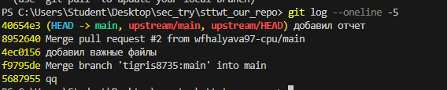
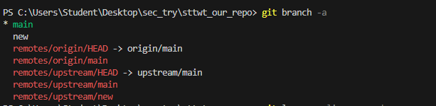
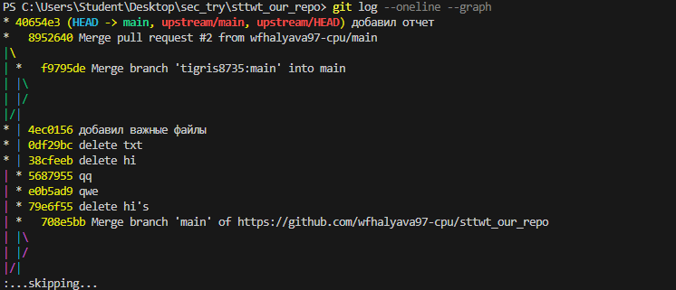

# Отчет по командной работе в GitHub

## Основная информация
- **Название проекта:** `создание общеги репозитория , написание метриков и программы для вывода данных`
- **Дата выполнения:** `24.09.2025`
- **Состав команды:** 
  - Тимлид: `tigris8735`
  - Падаван: `wfhalyava97-cpu`
  - Преподаватель: `Teacher001-top`

## Ссылки на репозитории
- **Основной репозиторий:** `https://github.com/tigris8735/sttwt_our_repo.git`
- **Форк падавана:** `https://github.com/wfhalyava97-cpu/sttwt_our_repo.git`
- **Pull Request:** `https://github.com/tigris8735/sttwt_our_repo/pull/2`

---

## Раздел Тимлида

### 1. Создание и настройка основного репозитория

**Выполненные действия:**
- [+] Создан репозиторий на GitHub.com
- [+] Добавлен README.md файл
- [+] Настроена видимость (Public/Private)
- [+] Проверена доступность репозитория

**Команды выполнения:**
```bash
# Локальная настройка
git config --global user.name "Tigris8735"
git config --global user.email "den0208@bk.ru"

# Клонирование основного репозитория
git clone https://github.com/tigris8735/our_repo.git
cd C:\Users\Student\Desktop\sec_try\sttwt_our_repo
```

**Результаты:**
- URL основного репозитория: `https://github.com/tigris8735/sttwt_our_repo.git`
- Количество начальных файлов: `1`
- Статус репозитория: `[+] Public [ ] Private`

### 2. Управление Pull Requests

**Полученные PR:**
| № | От кого | Ветка | Статус | Ссылка |
|---|---------|-------|--------|---------|
| 1 | `wfhalyava97-cpu` | `title` | `[ ] Открыт [+] Принят [ ] Отклонен` | `https://github.com/tigris8735/sttwt_our_repo/pull/2` |

**Проверка изменений:**
- [+] Код соответствует требованиям
- [+] Нет конфликтов слияния
- [+] Коммиты имеют понятные сообщения
- [+] Изменения логичны и завершены

**Действия по мержу:**
```bash
# Проверка перед мержем
git fetch origin
git checkout main
git log --oneline -5
```


### 3. Финальное состояние репозитория

**После принятия изменений:**
- Количество файлов: `5`
- Количество коммитов: `5`
- Актуальные ветки: `HEAD -> main, origin/main, origin/HEAD`

**Проверочные команды:**
```bash
git branch -a
git log --oneline --graph
```



---

## Раздел Падавана

### 1. Начальная настройка

**Выполненные действия:**
- [+] Создан форк основного репозитория
- [+] Локально клонирован форк
- [+] Настроена связь upstream

**Команды выполнения:**
```bash
# Клонирование форка
git clone https://github.com/wfhalyava97-cpu/sttwt_our_repo.git
cd C:\Users\Student\Desktop\sec_try\sttwt_our_repo

# Настройка upstream
git remote add upstream https://github.com/tigris8735/sttwt_our_repo.git
git remote -v
```

**Результаты проверки:**
```
origin    https://github.com/wfhalyava97-cpu/sttwt_our_repo.git (fetch)
origin    https://github.com/wfhalyava97-cpu/sttwt_our_repo.git (push)
upstream  https://github.com/tigris8735/sttwt_our_repo.git (fetch)
upstream  https://github.com/tigris8735/sttwt_our_repo.git (push)
```

### 2. Рабочий процесс

**Создание feature-ветки:**
- Имя ветки: `main`
- Цель изменений: `заполнение отчета`

**Команды работы:**
```bash
# Создание и переход на новую ветку
git checkout main
git fetch upstream
git merge upstream/main
git checkout -b ______

# Внесение изменений
# ... работа в VS Code ...

# Коммит изменений
git add .
git status
git commit -m "______"
```

**Внесенные изменения:**
- Созданные файлы: `metrics.md / отчет.md / f_metrics.py / ts_for_padavan.md`
- Измененные файлы: `metrics.md / отчет.md /`
- Удаленные файлы: `text.txt / tatus.md`

### 3. Отправка изменений и создание PR

**Команды отправки:**
```bash
git push origin ______
```

**Информация Pull Request:**
- Заголовок PR: `title`
- Описание изменений: `________________`
- Ссылка на PR: `https://github.com/tigris8735/sttwt_our_repo/pull/2`

**Статус PR:**
- [+] Создан
- [+] На проверке
- [-] Требуются исправления
- [+] Принят
- [-] Отклонен

---

## Совместные результаты

### 1. Граф коммитов (результат команды `git log --oneline --graph --all`)
```
*   40654e3_ (HEAD -> main, origin/main) Merge pull request #1 from tigris8735
|\  
| * f9795de (origin/main) Добавлен новый функционал
|/  
* 43c0156 Initial commit
```

### 2. Сравнение состояния репозитория

**До работы:**
- Файлов: `1`
- Веток: `1`
- Коммитов: `0`

**После работы:**
- Файлов: `5`
- Веток: `5`
- Коммитов: `18`

### 3. Вклад участников

| Участник | Количество коммитов | Созданные файлы | Внесенные изменения |
|----------|---------------------|-----------------|---------------------|
| Тимлид | `9` | `4` | `9` |
| Падаван | `9` | `0` | `9` |

---

## Проблемы и их решение

### Возникшие трудности:
1. **Проблема:** `создание форка`
   - **Решение:** `открыть репозиторий в режиме public`
   - **Результат:** `[+] Решено [ ] Частично решено [ ] Не решено`

2. **Проблема:** `________________`
   - **Решение:** `________________`
   - **Результат:** `[ ] Решено [ ] Частично решено [ ] Не решено`

### Типовые ошибки и их исправление:
- **Ошибка:** Конфликт слияния
  - **Как исправили:** `через терминал у падавана (команды в терминале , с помощью которых решали : git remote add upstream https://github.com/tigris8735/sttwt_our_repo.git ||||| git remote -v ||||| git fetch upstream |||||git merge upstream/main ||||| git push origin man)`
- **Ошибка:** Неправильная настройка remote
  - **Как исправили:** `не было ошибки`

---

## Проверочные тесты

### Тест для Тимлида:
- [ ] `git status` показывает "working tree clean"
- [ ] `git log` отображает мерж-коммит от PR
- [+] Все ветки актуальны (`git fetch --all`)
- [+] На GitHub отображаются все изменения

### Тест для Падавана:
- [+] `git remote -v` показывает origin и upstream
- [+] Локальная main ветка синхронизирована с upstream
- [ ] PR имеет статус "Merged"
- [+] Локально можно переключиться на обновленную main

---

## Выводы и заключение

### Что получилось:
- [+] Организована командная работа
- [+] Освоен процесс Fork-Pull Request
- [+] Выполнена поставленная задача
- [+] Код успешно объединен

### Что нужно улучшить:
- `________________`
- `________________`

### Общая оценка работы команды: `[ ] Отлично [ ] Хорошо [+] Удовлетворительно`

---

## Подписи участников

**Тимлид:**
- GITHUBID: `tigris8735` 
- Подпись: `tigris8735`
- Дата: `( 10:30 ) 25.09.25`

**Падаван:**
- GITHUBID: `wFhalyava97-cpu`
- Подпись: `wFhalyava97-cpu` 
- Дата: `( 10:30 ) 25.09.25`

**Преподаватель:**
- GITHUBID: `Teacher001-top`
- Подпись: `________________`
- Дата: `________________`
- Оценка: `________________`

> *Отчет составлен автоматически на основе выполненных действий в GitHub*